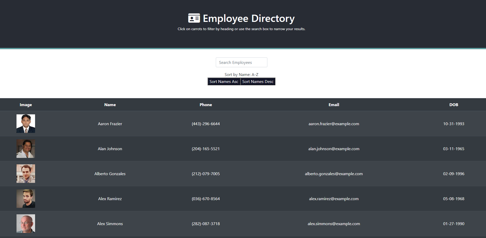

# Employee Directory
 

## Description 
A react app to enable a user to search and sort through a robust employee directory. The user can search a name and sort names by alpabetical order.

[View the Deployed App Here](https://kairora.github.io/employee-directory/)



---

## Table of Contents
1. [Installation](#Installation)
2. [Usage](#Usage)
3. [License](#license)
4. [Contributing](#Contributing)
5. [Questions](#Questions)
---

## Installation
1. Install dependencies: react-router-dom, dayjs, bootstrap, axios, react-router, react-scripts, react using code ```npm install``` 
2. Run code ```npm start``` to open the app in local

## Usage
Once dependencies are installed, the user is greeted with a simple UI including a list of employees, search input for name searching and buttons to sort the list of employees by ascending and descending name order.

---

## License
### ISC License
Copyright (c) 2020 Brianna Bullock

Permission to use, copy, modify, and/or distribute this software for any purpose with or without fee is hereby granted, provided that the above copyright notice and this permission notice appear in all copies.

THE SOFTWARE IS PROVIDED "AS IS" AND THE AUTHOR DISCLAIMS ALL WARRANTIES WITH REGARD TO THIS SOFTWARE INCLUDING ALL IMPLIED WARRANTIES OF MERCHANTABILITY AND FITNESS. IN NO EVENT SHALL THE AUTHOR BE LIABLE FOR ANY SPECIAL, DIRECT, INDIRECT, OR CONSEQUENTIAL DAMAGES OR ANY DAMAGES WHATSOEVER RESULTING FROM LOSS OF USE, DATA OR PROFITS, WHETHER IN AN ACTION OF CONTRACT, NEGLIGENCE OR OTHER TORTIOUS ACTION, ARISING OUT OF OR IN CONNECTION WITH THE USE OR PERFORMANCE OF THIS SOFTWARE. 

---
## Contributing
To make suggestions or contribute to this project, please email Brianna at the link below.

---

## Questions

You can visit my [Github Profile](https://www.github.com/kairora) or [this app's Github repo](https://github.com/kairora/employee-directory) to learn more about this.
Or, if you have questions regarding this program, please [send me an email](mailto:brianna.bullock16@gmail.com). 